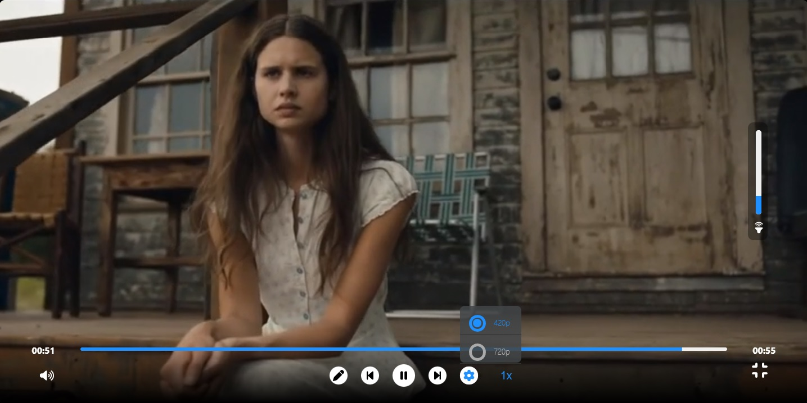

# Custom Video Player
## Table of contents

- [Overview](#overview)
  - [The challenge](#the-challenge)
  - [Screenshot](#screenshot)
- [My process](#my-process)
  - [Built with](#built-with)
- [Installing](#Installing)
- [Links](#Links)

---

## The challenge

The challenge was to build out Custom Video Player with React JS. 

---

## Screenshot

- 375px, 768px:

|                                          |                                          |
| ---------------------------------------- | ---------------------------------------- |
|  |  |

- 1440px:

## 


## My process

## Built with

- React JS 
- TypeScript
- styled-components


## Installing 🔍

To install this application:

```
npm install
npm start

```

##

## Links

- Solution URL: [](https://teonazav.github.io/react-ts-video-player1/)
